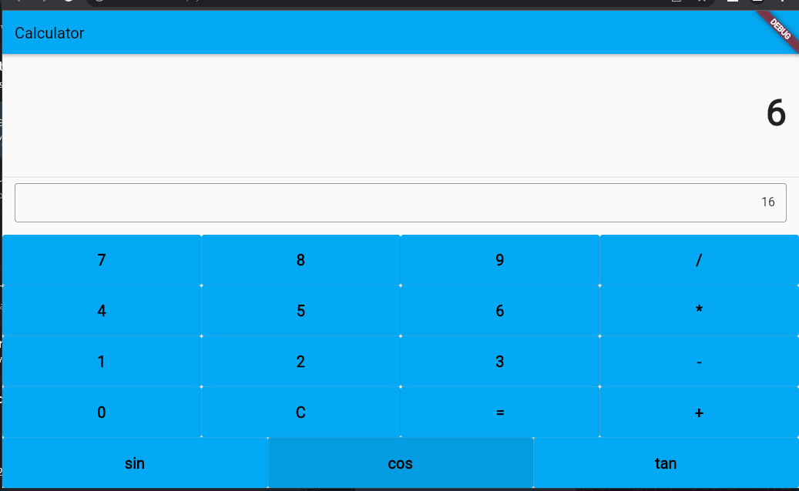
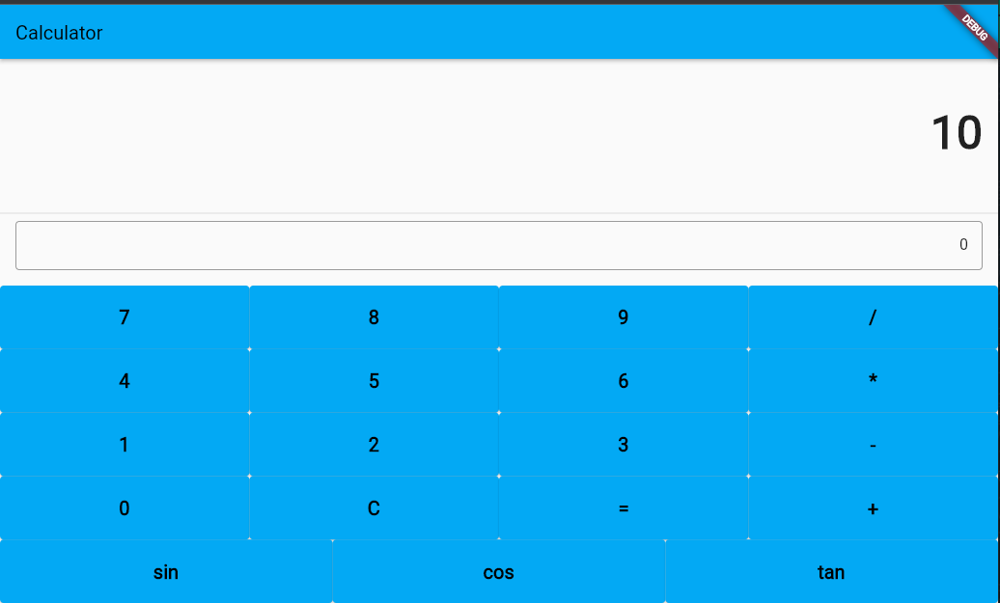
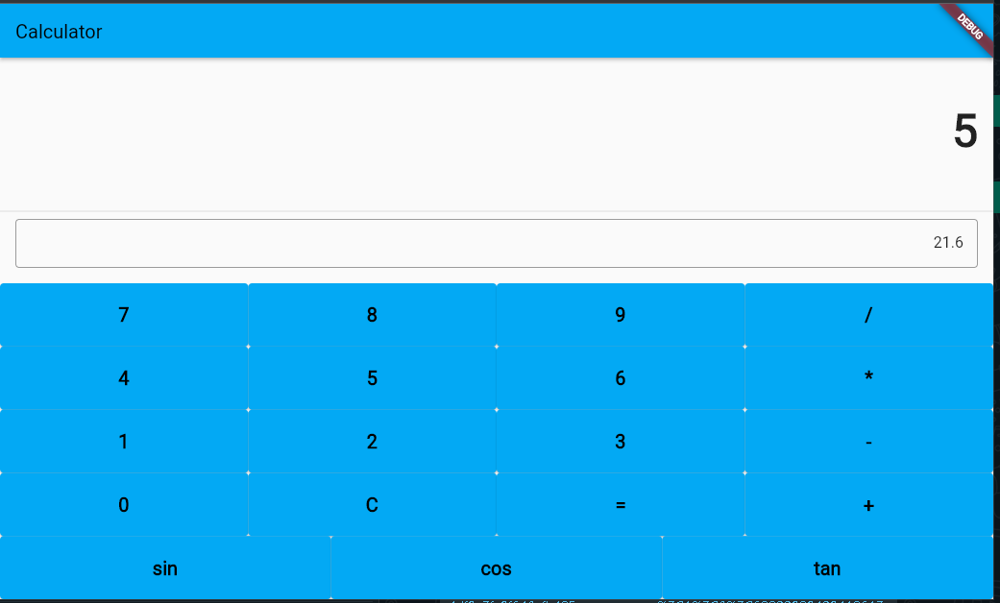
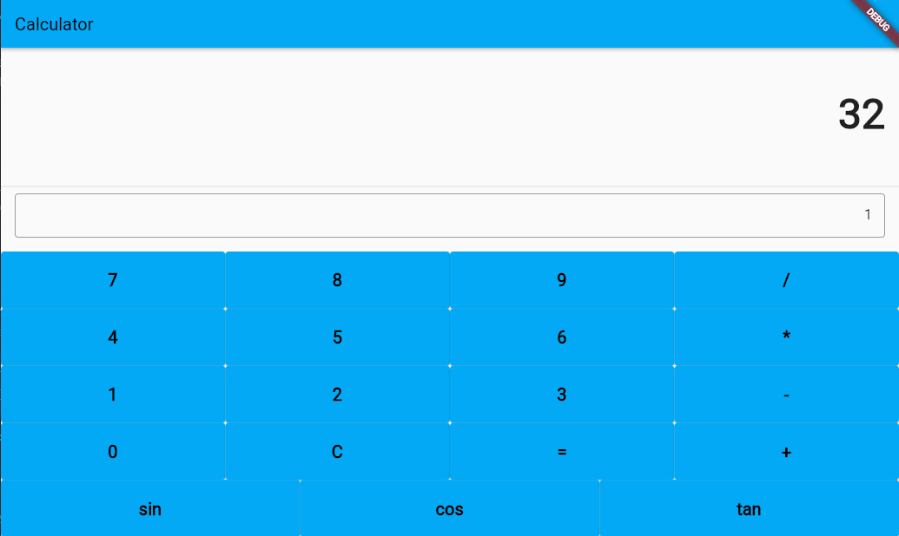

# Calculadora en Flutter con tres operaciones básicas y tres funciones trigométricas

## Autor: Mayra Ñaupari

## Operaciones básicas

## Suma

## Resta

## Multiplicación

## División

## Funciones Trigonométricas

## Seno

## Coseno

